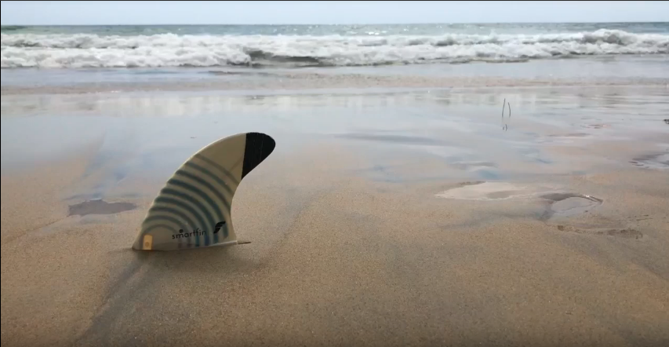
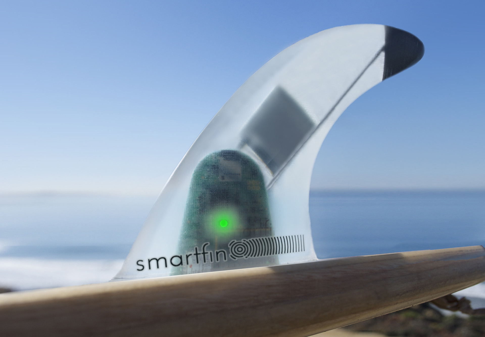

# Smartfin

The Smartfin Project aims to unite the surfing community and the research community in an effort to fill this gap in our oceanographic data. It began years ago with the collaborative vision of scientists and researchers working with the Scripps Institute of Oceanography, who hoped to innovate a new way to model the behaviour of our oceans. 

